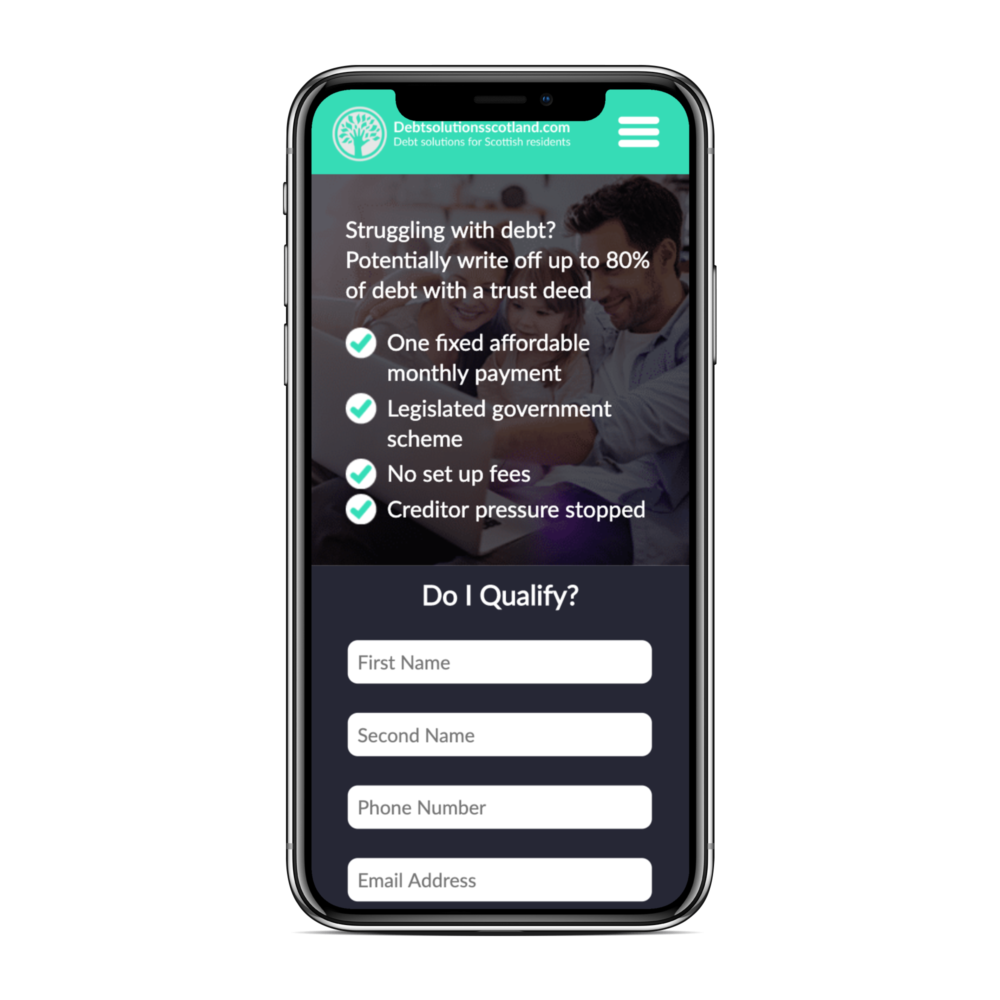

<TwoCol>

<h3>Debt Solutions Scotland - Responsive Website Development</h3>

  Debt Solutions Scotland is a website providing information and advice on debts
  and allows the customer to use the Debt Calculator which submits their data to
  the company - allowing leads to be generated in a user-friendly manner.I
  worked closely with a graphic designer, making a pixel perfect match to
  designs created in Adobe Illustrator,{' '}
  <a
    target="_blank"
    rel="noopener noreferrer"
    href="https://xd.adobe.com/spec/3b88cbd6-d117-472b-74de-e2c4d24ea36e-4db9/grid"
  >
    View Desktop Designs
  </a>
  , also you can <a
    target="_blank"
    rel="noopener noreferrer"
    href="https://xd.adobe.com/spec/7fd83774-0f6a-4565-5b33-70d744bf8348-09e9/grid"
  >
    View Mobile Designs
  </a>. The website was then built using React. The website was then bundled to be
  run on a static domain. <a
    target="_blank"
    rel="noopener noreferrer"
    href="https://debtsolutionsscotland.com/"
  >
    Visit Site..
  </a>

</TwoCol>
